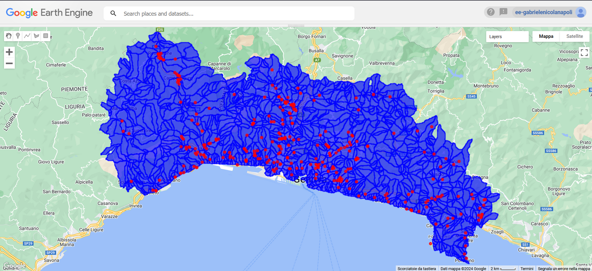
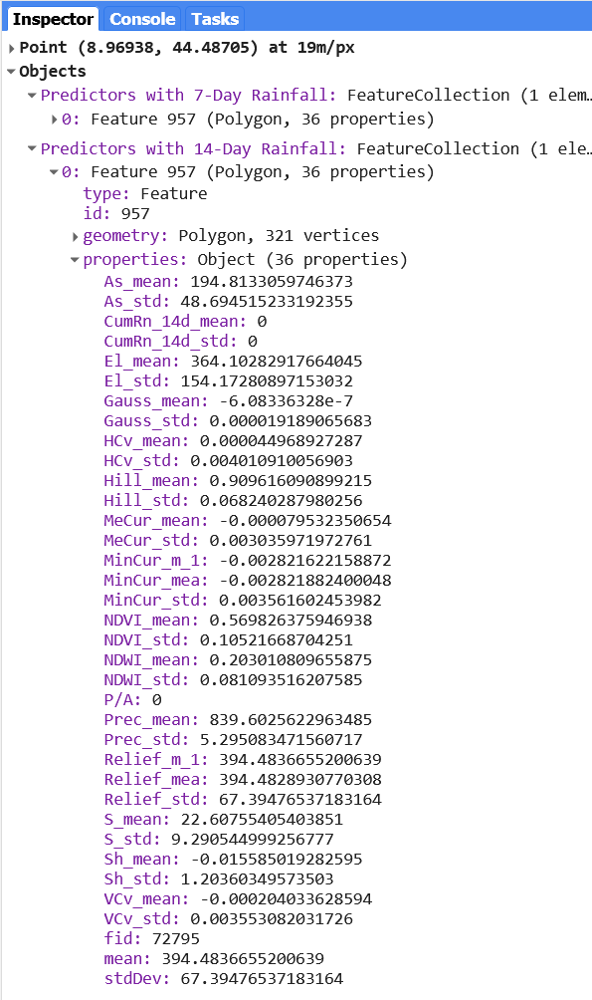
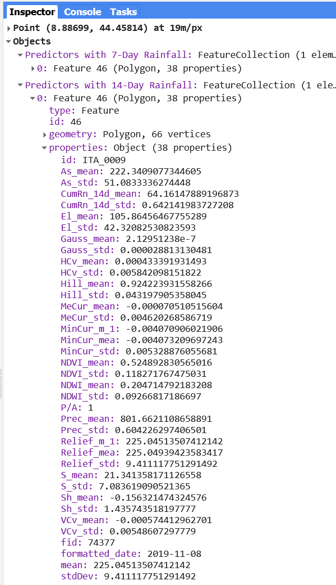

<!--SU ID(s) (with corresponding counter) of SUs where one or more landslides are placed, as well as the amount of precipitation (min, man, mean, and StDev) for one or more landslides and for a given date, can all be retrieved using the script that follows (see the file code.js).

Script outputs:

 
-->

# Overview

This script processes a dataset of rainfall-induced landslides in Italy, utilizing Earth Engine to analyze the relationship between rainfall and landslide occurrences. The dataset and methodology are described in the following publication:

**Brunetti, M. T., Melillo, M., Gariano, S. L., Guzzetti, F., Bartolini, D., Brutti, F., Bianchi, C., Calzolari, C., Denti, B., Gioia, E., Luciani, S., Martinotti, M. E., Palladino, M. R., Pisano, L., Roccati, A., Solimano, M., Vennari, C., Vessia, G., Viero, A., & Peruccacci, S. (2023).** ITALICA (ITAlian rainfall-induced LandslIdes CAtalogue) (Version 2) [Data set]. Zenodo. https://doi.org/10.5281/zenodo.8009366

## Key References

- **Alvioli, M., Marchesini, I., Reichenbach, P., Rossi, M., Fiorucci, F., Ardizzone, F., & Guzzetti, F. (2016).** doi:10.5194/gmd-9-3975-2016
- **Alvioli, M., Guzzetti, F., & Marchesini, I. (2020).** doi:10.1016/j.geomorph.2020.107124

For questions, comments, or bug fixes, please contact:

- Ivan Marchesini: ivan.marchesini[AT]irpi.cnr.it
- Massimiliano Alvioli: massimiliano.alvioli[AT]irpi.cnr.it

# Script Description

This script performs the following key operations:

1. **Load Data**: It loads two FeatureCollections:
   - Predictor polygons representing geographical areas.
   - Landslide points indicating where landslides have occurred.

2. **Cleanup Index**: It resets the `system:index` for both collections to ensure unique identifiers.

3. **Identify Overlapping Points**: The script identifies landslide points that fall within the predictor polygons.

4. **Process Polygons**: For each polygon, it aggregates the first occurrence of the date and ID fields from the overlapping landslide points and determines the presence/absence of landslides.

5. **Load Rainfall Data**: It loads the GPM GSMaP ImageCollection to retrieve rainfall data.

6. **Add Cumulative Rainfall**: A function computes the cumulative rainfall over specified periods (7 and 14 days) for each polygon based on the landslide occurrence dates.

7. **Visualization**: The results are visualized on the map, displaying polygons with cumulative rainfall data and landslide points.

8. **Export Results**: The script includes commented-out code to export the results as CSV files for further analysis.

# Visualization

- The script visualizes the predictors with 7-day cumulative rainfall in red and 14-day cumulative rainfall in blue.
- Landslide points are also displayed in red on the map.

# Script outputs:

<table>
  <thead>
    <tr>
      <th colspan="2">
        
        
Results Overview

      </th>
    </tr>
  </thead>
  <tbody>
    <tr>
      <td>
        
        
Not Overlapped Points Results

      </td>
      <td>
        
        
Overlapped Points Results

      </td>
    </tr>
  </tbody>
</table>

# Usage

To run this script, ensure you have access to Google Earth Engine and the required datasets. Uncomment the export sections to save the results to your Google Drive.

# License

This project is licensed under the MIT License - see the LICENSE file for details.

